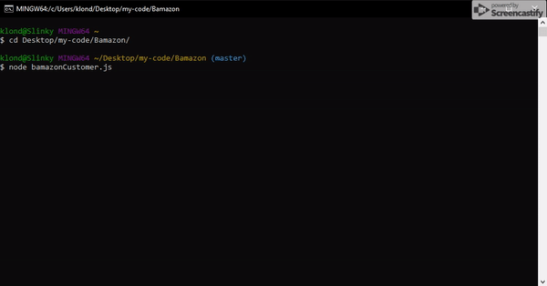

# Bamazon

A CLI mock storefront using node.js and MySQL!

## Installing

Once you've cloned the repository, you'll need to install the required node packages listed in packages.json. This is done with a simple npm install command.

You'll also need a MySQL instance to setup a bamazonDB on with the provided schema.sql, and optionally fill it with some products from seed.sql.

##Bamazon Customer

The customer interface prints a table to the terminal with the list of products. Taking in orders by item ID, and quantity. Updating the user if there isn't enough in stock or updating the stock and listing the purchase total.

## Built With
* Javascript
* Node
* Inquirer
* cli-table
* MySQL

## Authors

* **Andrew Meyer** - *Initial work* - [Andypants152](https://github.com/Andypants152)